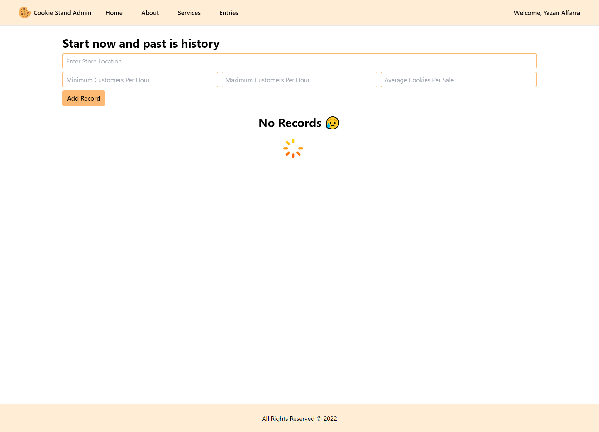

# Intro to Next.js & Tailwind CSS

A web application built with Next JS 13, where a user can enter his/her sales and view them in a card format to keep track of his/her sales.

## Author(s)

**Yazan Alfarra**

## Program Output

**Home/About/Services Pages**

**Entries Page**

> With no entries

> With entries

